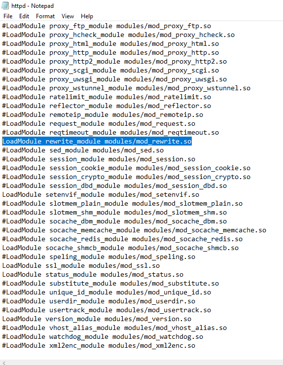
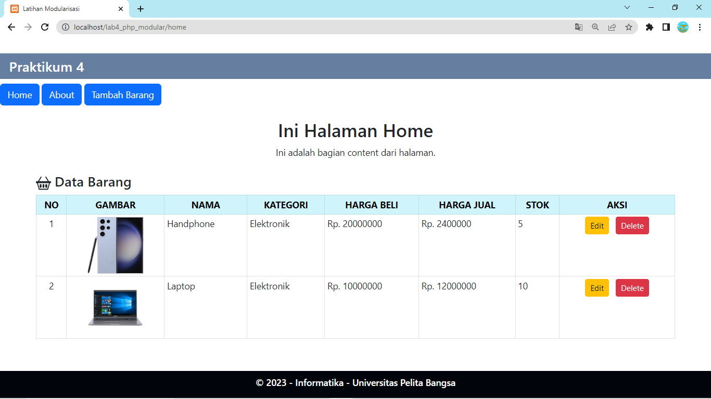

# Tugas Pemrograman Web 2 (Praktikum 4)
## Profil
| #               | Biodata                      |
| --------------- | ---------------------------- |
| **Nama**        | Muhammad Alwi Nur Fathihah   |
| **NIM**         | 312110388                    |
| **Kelas**       | TI.21.A.1                    |
| **Mata Kuliah** | Pemrograman Web 2            |

# Persiapan
1. Persiapkan text editor misalnya VSCode.
2. Buat folder baru dengan nama lab4_php_modular pada docroot webserver (htdocs)
3. Ikuti langkah-langkah praktikum yang akan dijelaskan berikutnya.

# Langkah-langkah Praktikum 
- Melanjutkan pertemuan 3 atau praktikum sebelumnya, namun disini kita akan menambahkan/membuat Routing.
- disini file index.php di praktikum sebelumnya dipisah menjadi `header.php` dan `home.php`.
- Kemudian buat file baru dengan nama `index.php`, lalu masukan kode berikut.

```php
<?php

if (isset($_REQUEST['mod'])) {
    $mod = $_REQUEST['mod'];
} else {
    $mod = 'home';
}

switch ($mod) {
  case "home":
    require("home.php");
    break;
  case "tambah":
    require("tambah.php");
    break;
  case "about":
    require("about.php");
    break;
  default:
    require("home.php");
}
?>

```

# Aktifasi mod_rewrite (.htaccess)
<p>Mod_rewrite digunakan untuk mengubah URL dari query string menjadi SEO Friendly.</p>
- Langkah awal yang harus disiapkan adalah aktivasi mod_rewrite pada webserver Apache2 pada configurasi httpd.conf.
- Untuk mencari file "httpd.conf", kita perlu membuka folder "C:\xampp\apache\conf"



- Aktifkan LoadModule mod_rewrite dengan cara melakukan un-comment pada baris tersebut, kemudian restart Apache2.
- Langkah berikutnya adalah membuat file `.htaccess`, kemudian masukan kode berikut.

```.htaccess
<IfModule mod_rewrite.c>
    RewriteEngine On
    RewriteBase /lab4_php_modular/
    RewriteCond %{REQUEST_FILENAME} !-f
    RewriteCond %{REQUEST_FILENAME} !-d
    RewriteRule ^(.*)$ index.php?mod=$1 [L]
</IfModule>
```

### Sekarang cara mengaksesnya menjadi:
- Halaman View (http://http://localhost/lab4_php_modular/home)
- Halaman Tambah Barang (http://http://localhost/lab4_php_modular/tambah)
- Halaman About (http://http://localhost/lab4_php_modular/about)



# Terima Kasih!